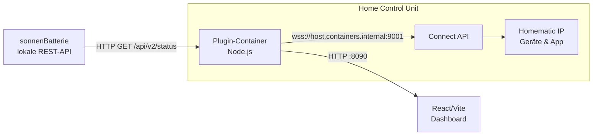
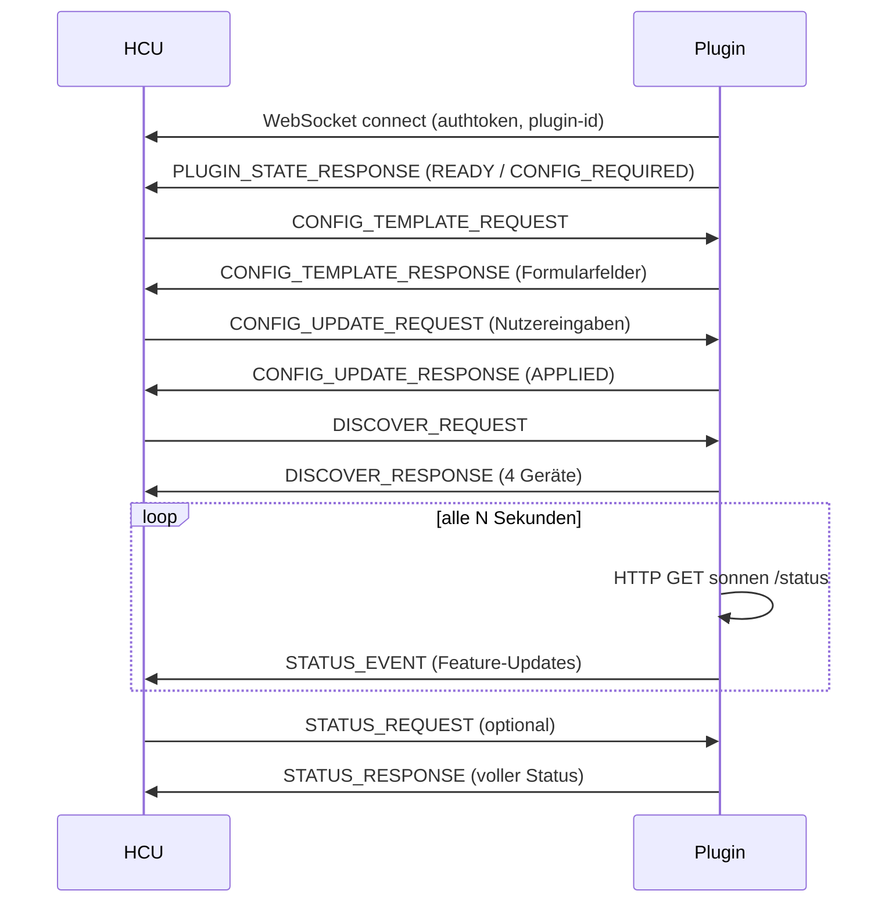

# Umsetzungskonzept: sonnenBatterie → Homematic IP (HCU Connect API)

Dieses Dokument beschreibt Architektur und Datenfluss des Plugins und dient als
technische Referenz. Die Bedienung steht im [README](../README.md).

## 1. Zielbild

Das Plugin ist eine **Brücke**: Es fragt zyklisch die Batterie per HTTP ab und
schiebt die Werte über die WebSocket-basierte Connect API als Geräte-Status in
das Homematic IP System.

## 2. Komponenten

| Modul | Aufgabe |
| --- | --- |
| `sonnenClient.js` | HTTP-GET auf `/api/v2/status` (bzw. `/api/v1/status`), Normalisierung der Rohwerte inkl. Vorzeichen. |
| `deviceMapper.js` | Abbildung der normalisierten Daten auf Connect-API-Geräte (`BATTERY`, `INVERTER`, `GRID_CONNECTION_POINT`, `ENERGY_METER`) und deren Features. |
| `hcuClient.js` | WebSocket-Verbindung, Reconnect, Beantwortung aller Connect-API-Nachrichten, Senden von `STATUS_EVENT`. |
| `config.js` | Konfig-Template für HCUweb, Persistenz (`/app/data/config.json`), Übernahme von `CONFIG_UPDATE_REQUEST`. |
| `dashboard.js` | Eingebetteter HTTP-Server: liefert das gebaute Frontend und eine `GET /api/state`-JSON-Schnittstelle. |
| `index.js` | Verdrahtung: Polling-Loop, Readiness-Logik, Lebenszyklus. |
| `frontend/` | React-/Vite-Dashboard, das `GET /api/state` pollt. |

## 3. Connect-API-Nachrichtenfluss

Behandelte Nachrichtentypen: `PLUGIN_STATE_REQUEST`, `DISCOVER_REQUEST`,
`STATUS_REQUEST`, `CONFIG_TEMPLATE_REQUEST`, `CONFIG_UPDATE_REQUEST`,
`CONTROL_REQUEST` (read-only → abgelehnt), `ERROR_RESPONSE`.

## 4. Feld-Mapping sonnen → Connect API

| sonnen-Feld | Bedeutung | HCU-Gerät | Feature |
| --- | --- | --- | --- |
| `USOC` / `RSOC` | Ladezustand % | `BATTERY` | `batteryState.batteryLevel` (0–1) |
| `RemainingCapacity_Wh` (+ Konfig) | Kapazität | `BATTERY` | `batteryState.batteryCapacity` (Wh) |
| `Pac_total_W` | Batterieleistung | `BATTERY` | `currentPower` (⁠−Pac: + = laden) |
| `Production_W` | PV-Leistung | `INVERTER` | `currentPower` |
| `GridFeedIn_W` | Netz | `GRID_CONNECTION_POINT` | `currentPower` (⁠−FeedIn: + = Bezug) |
| `Consumption_W` | Hausverbrauch | `ENERGY_METER` | `currentPower` |

Die Vorzeichen-Konvention ist bewusst so gewählt, dass sie zu den nativen
Homematic IP Messgeräten passt (Bezug positiv, Einspeisung negativ; Laden
positiv, Entladen negativ).

## 5. Readiness-Logik

| Zustand | Bedingung |
| --- | --- |
| `CONFIG_REQUIRED` | IP oder (bei V2) Token fehlt. |
| `ERROR` | Konfiguriert, aber Batterie beim Start nicht erreichbar. |
| `READY` | Konfiguriert und letzte Abfrage erfolgreich. |

Der Status wird proaktiv gesendet (Start, nach Config-Update, nach Poll-Fehler)
und auf `PLUGIN_STATE_REQUEST` beantwortet.

## 6. Persistenz & Robustheit

- Konfiguration wird nach `/app/data/config.json` geschrieben (Pfad via
  `SONNEN_CONFIG_PATH` änderbar). So bleibt sie über Container-Neustarts
  erhalten und füllt das Formular (`currentValue`) vor.
- WebSocket mit **exponentiellem Reconnect** (2 s → max. 30 s).
- HTTP-Abfragen mit Timeout (8 s); Fehler setzen `ERROR`, ohne das Plugin zu
  beenden.
- `CONTROL_REQUEST` wird abgelehnt (`FEATURE_NOT_SUPPORTED`), da alle Geräte
  read-only sind.

## 7. Containerisierung

Multi-Stage-`Dockerfile`:

1. **frontend** (`node:20-alpine`): baut das React-/Vite-Dashboard nach `dist/`.
2. **runtime** (`ghcr.io/homematicip/alpine-node-simple`, `linux/arm64`):
   installiert die Produktionsabhängigkeiten, kopiert `plugin/src` und das
   gebaute Dashboard nach `/app/public`, setzt Entrypoint und das
   `de.eq3.hmip.plugin.metadata`-Label.

Export als `*.tar.gz` (`docker save | gzip`) für den Upload in HCUweb.

## 8. Erweiterungsideen

- `EnergyCounter` (kWh) ergänzen, sobald kumulierte Zählerstände aus
  `/api/v2/latestdata` bzw. `/api/v2/battery` genutzt werden.
- Weitere Endpunkte (`/api/v2/powermeter`, `/api/v2/inverter`) für zusätzliche
  Detailwerte.
- Mehrsprachige `friendlyName`/`description` je Gerät.
